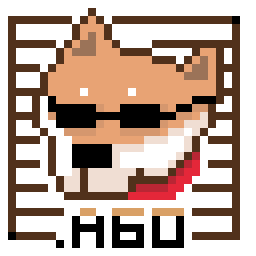

# blgo60

Bingo, bangle, bungle, I'm so happy in the jungle, I refuse to go
# doge-algol60

Algol 60 compiler.

## Reference
- https://www.masswerk.at/algol60/algol60-syntaxversions.htm
- https://www.masswerk.at/algol60/modified_report.htm
- https://www.masswerk.at/algol60/algol60-sample.htm
- http://www.algol60.org/reports/algol60_rr.pdf
- http://www.algol60.org/docs/Rutishauser_Description_of_ALGOL_60_1967.pdf
- http://algol60.org/6legoPieces.htm
- http://csci.csusb.edu/dick/samples/algol60.syntax.html
- https://www.memorymanagement.org/mmref/lang.html
- https://wiki.tcl-lang.org/page/Algol
